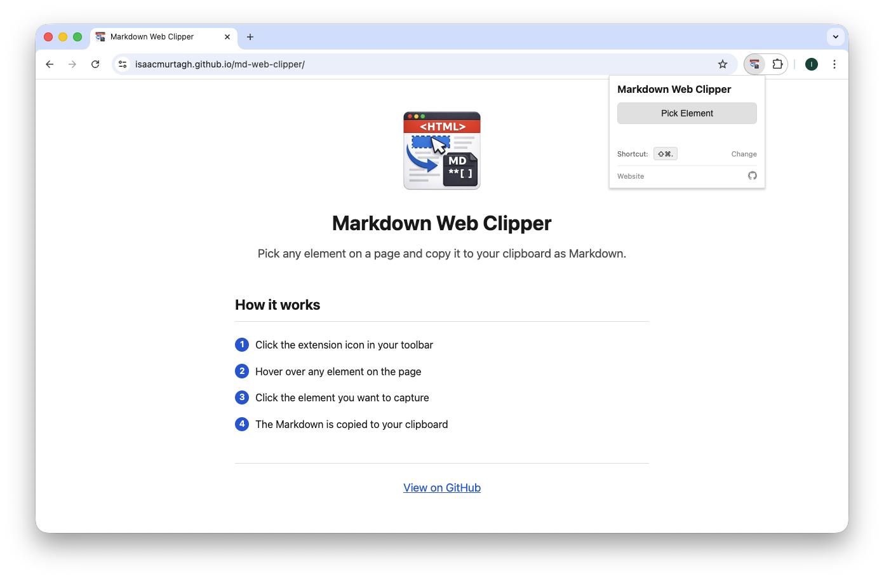
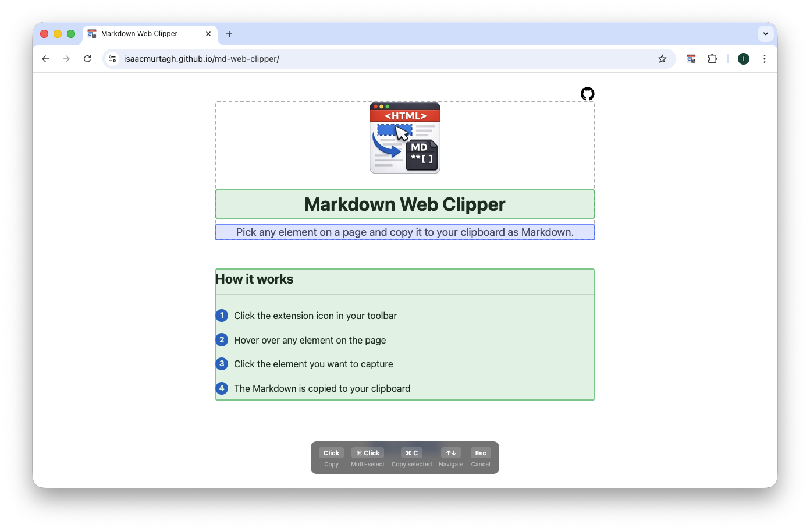
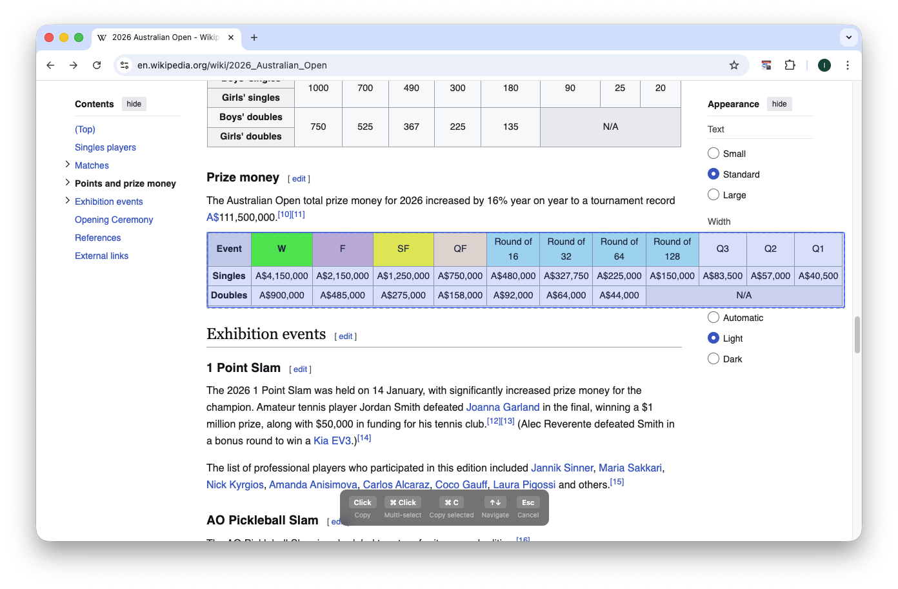

# Markdown Web Clipper

A browser extension for Chrome and Firefox that lets you pick any element on a page and copy it to your clipboard as Markdown.

<!-- Firefox Add-ons - uncomment when approved

-->

[Website](https://isaacmurtagh.github.io/md-web-clipper/)

## How it works

1. Click the extension icon or press **⌘⇧.** to activate the picker
2. Hover over any element — use **↑↓** arrow keys to navigate to parent or child elements
3. Click to copy, or **⌘Click** to multi-select then **⌘C** to copy all
4. The Markdown is copied to your clipboard — paste it anywhere

## Features

- **Element picker** — hover and click to grab any element
- **Parent navigation** — arrow keys to walk up and down the DOM tree
- **Multi-select** — ⌘Click to select multiple elements, ⌘C to copy all
- **Tables** — HTML tables convert to clean GFM Markdown tables
- **Keyboard shortcut** — configurable via `chrome://extensions/shortcuts`

## Install from source

1. Clone this repo
2. Open `chrome://extensions/` and enable **Developer mode**
3. Click **Load unpacked** and select the project folder
4. Navigate to any page and click the extension icon

## Third-party

This extension bundles [Turndown](https://github.com/mixmark-io/turndown) and [turndown-plugin-gfm](https://github.com/mixmark-io/turndown-plugin-gfm) by Dom Christie (MIT License) for HTML-to-Markdown conversion.

## License

MIT — see [LICENSE](LICENSE) for details.
